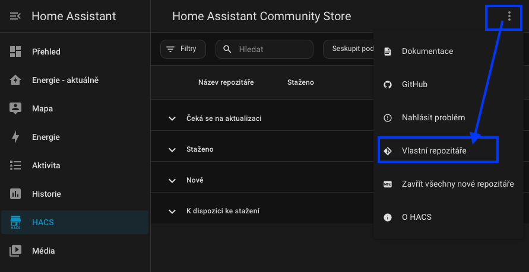
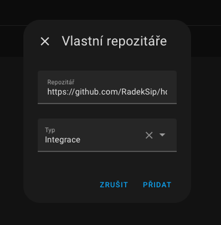
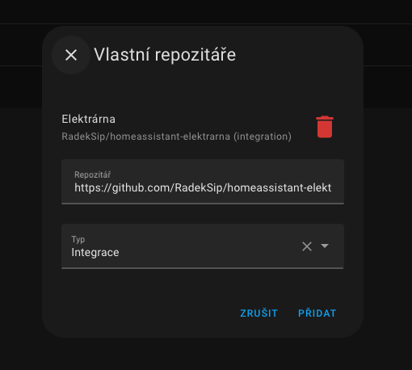
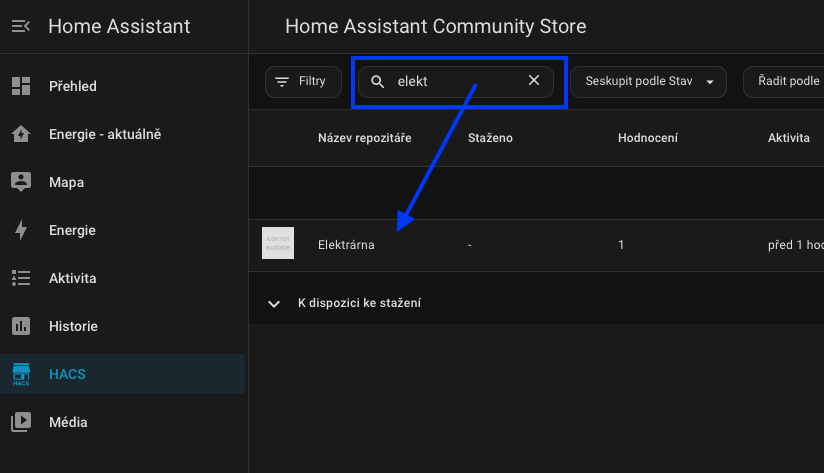
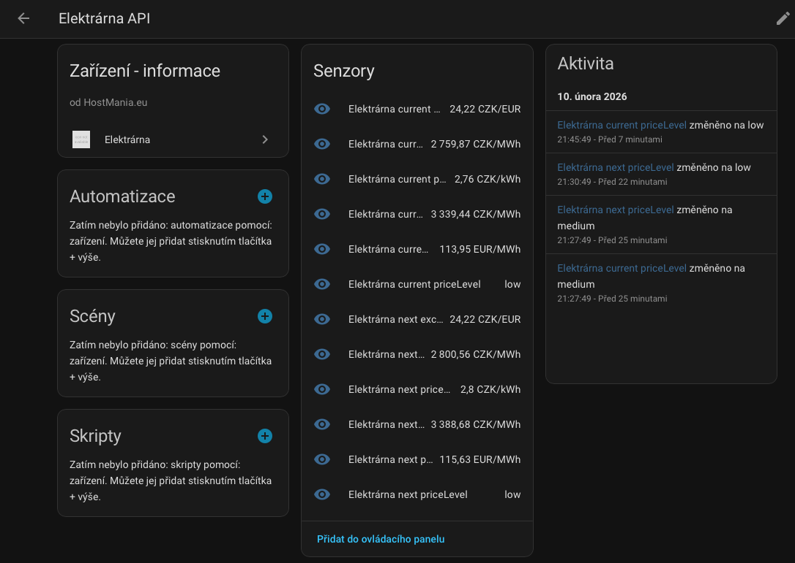

# Elektrárna - electricity spot prices for Czech Republic

**English:**

This plugin imports electricity spot prices for the Czech Republic. I don’t expect users from other countries, so the plugin is available only in Czech.

**Czech:**

Tato integrace získává informace o cenách elektřiny z API `elektrarna.hostmania.eu` a zpřístupňuje je jako senzory v Home Assistant.
Více informací a další možnosti integrace naleznete na domovském webu [elektrarna.hostmania.eu](https://elektrarna.hostmania.eu)

## Funkce
Využívá veřejného API Elektrárna dostupného zde: [elektrarna.hostmania.eu/api](https://elektrarna.hostmania.eu/api)
- **Aktuální cena:** Data pro aktuální čtvrthodinu.
- **Budoucí cena:** Data pro příští čtvrthodinu.
- **Nejlevnější intervaly:** Data o nejlevnějších intervalech pro dnešní den (souvislé bloky 1h-8h).
- **Nejlevnější intervaly 34h:** Data o nejlevnějších intervalech pro dnešek+zítřek (souvislé bloky 1h-8h). Dostupné pouze 15-24hod (po zveřejnění cen do půlnoci)
- **Senzory:**
  - Cena v EUR/MWh
  - Cena v CZK/MWh
  - Cena v CZK/MWh s DPH
  - Cena v CZK/kWh
  - Použitý kurz CZK/EUR
  - Cenová hladina (low, medium, high)
  - Pro nejlevnější intervaly (souvislé časové bloky 1h-8h):
    - Hodina začátku (startHour)
    - Minuta začátku (startMinute)
    - Hodina konce (endHour)
    - Minuta konce (endMinute)
    - Průměrná cena v CZK/kWh (averagePriceCzkKwh)
  - Pro nejlevnější intervaly 34h (souvislé časové bloky 1h-8h):
    - Hodina začátku (startHour)
    - Minuta začátku (startMinute)
    - Hodina konce (endHour)
    - Minuta konce (endMinute)
    - Průměrná cena v CZK/kWh (averagePriceCzkKwh)
    - Začátek zítra (startIsTomorrow)
    - Konec zítra (endIsTomorrow)

## Instalace

### Pomocí HACS (doporučeno)
1. Otevřete HACS (pokud ho nemáte nainstalován, je třeba tak udělat podle některého z mnoha návodů na internetu)
2. Jděte do sekce **Integrace**.
3. Klikněte na menu (tři tečky) vpravo nahoře a zvolte **Vlastní repozitáře**.

4. Vložte URL tohoto repozitáře: `https://github.com/RadekSip/homeassistant-elektrarna`.
5. Vyberte kategorii **Integrace**.

6. Klikněte na **Přidat**
7. Jakmile uvidíte, že je již přidána (link s ikonou červené popelnice), můžete dialog zavřít (opakované "Přidat" bude hlásit chybu)

8. Nyní můžete vyhledat integraci "Elektrárna" v seznamu a stáhnout (nainstalovat)
9. **Restartujte Home Assistant.**

### Manuální instalace
1. Stáhněte si tento repozitář.
2. Zkopírujte složku `custom_components/elektrarna` do složky `custom_components` ve vašem Home Assistant.
3. Restartujte Home Assistant.

## Konfigurace po instalaci
1. Jděte do **Nastavení** -> **Zařízení a služby**.
2. Klikněte na **+ PŘIDAT INTEGRACI**.
3. Vyhledejte **Elektrárna**.
4. Potvrďte přidání.

Všechny senzory se objeví pod zařízením **Elektrárna**.

